<div align="center">


<br/>

<a href="https://github.com/dantaspaulo/skill-perfil-github/releases/latest/download/perfil-github.zip"></a>
<a href="https://github.com/dantaspaulo/skill-perfil-github/releases/latest/download/perfil-github.skill"></a>
<a href="https://github.com/dantaspaulo"></a>


<br/><br/>

**Você fez coisa boa, mas o seu GitHub não mostra.**<br/>
Esta skill faz o Claude transformar o seu perfil numa vitrine que se lê em 20 segundos:<br/>quem você é, o que você entrega e a prova disso.

<br/>

<picture>
  <source media="(max-width: 700px)" srcset="docs/assets/numeros-celular.svg" />
  
</picture>

</div>

<br/>

<div align="center">

## ✨ Um perfil feito com ela

<a href="https://github.com/dantaspaulo">
<picture>
  <source media="(max-width: 700px)" srcset="https://raw.githubusercontent.com/dantaspaulo/dantaspaulo/main/assets/cases-celular.svg" />
  
</picture>
</a>

<sub>Os cases do meu perfil, com o mesmo gerador. <a href="https://github.com/dantaspaulo"><b>Veja ao vivo em github.com/dantaspaulo</b></a>.<br/>Cliente que não autorizou o nome aparece pelo setor.</sub>

</div>

<br/>

<div align="center">

## 🧭 Como ela trabalha

<picture>
  <source media="(max-width: 700px)" srcset="docs/assets/metodo-celular.svg" />
  
</picture>

</div>

1. **Descobrir.** O Claude lê o que já é público: seu perfil do GitHub, o README atual, seu site e seu LinkedIn. Mostra quais repositórios dá para fixar e avisa se a sua contagem de contribuições está inflada por algum robô de backup.
2. **Perguntar.** Só o que faltou, em até 3 rodadas curtas, e sempre com um rascunho para você aprovar. Em cada case: o nome do cliente pode aparecer? De onde vem esse número?
3. **Montar.** Seus textos vão para um `perfil.json` **fora** do repositório público, e o gerador cria o `README.md` e os cartões animados.
4. **Conferir.** Uma trava recusa publicar se um nome proibido aparecer em qualquer arquivo, se um texto não couber no cartão ou se algo parecer senha, IP ou rascunho.
5. **Publicar.** Primeiro uma prévia de computador e de celular lado a lado. Só vai ao ar com o seu ok.

<div align="center">

<br/>

<picture>
  <source media="(max-width: 700px)" srcset="docs/assets/principios-celular.svg" />
  
</picture>

</div>

<br/>

<div align="center">

## 🎨 Quatro temas, ou o seu

<picture>
  <source media="(max-width: 700px)" srcset="docs/assets/temas-celular.svg" />
  
</picture>

<sub>Champagne, esmeralda, oceano e grafite. Tem site com cor própria? O Claude monta um tema a partir dele.</sub>

</div>

<br/>

## 📥 Instalar

**Claude Code** (macOS ou Linux):

```bash
curl -L -o /tmp/perfil-github.zip https://github.com/dantaspaulo/skill-perfil-github/releases/latest/download/perfil-github.zip
unzip -o /tmp/perfil-github.zip -d ~/.claude/skills/
```

**Claude Code** (Windows, PowerShell):

```powershell
Invoke-WebRequest -Uri https://github.com/dantaspaulo/skill-perfil-github/releases/latest/download/perfil-github.zip -OutFile "$env:TEMP\perfil-github.zip"
Expand-Archive -Force "$env:TEMP\perfil-github.zip" "$HOME\.claude\skills\"
```

**Claude.ai ou app do Claude:** baixe o [`.zip`](https://github.com/dantaspaulo/skill-perfil-github/releases/latest/download/perfil-github.zip) e envie em **Configurações → Capacidades → Skills**.

Depois, abra uma conversa nova.

## 💬 Usar

Peça do seu jeito:

> deixa meu perfil do GitHub com cara de portfólio, meu usuário é fulano

> quero colocar meus cases no GitHub sem citar os clientes

> alinha meu GitHub com o meu site novo: fulano.dev

Na máquina: `python3` e `git`. O [GitHub CLI](https://cli.github.com) (`gh`) logado é opcional; com ele o Claude faz o diagnóstico do perfil e a prévia exatamente como o GitHub mostra.

## 🔐 Seus dados

- O `perfil.json` (seus textos) e o `nao-citar.txt` (nomes que nunca podem sair) ficam numa pasta de trabalho **fora** do repositório. No GitHub vão só o `README.md` e a pasta `assets/`.
- Nada é enviado para serviço nenhum além do próprio GitHub, e só quando você mandar publicar.
- A skill não traz dado de ninguém: os exemplos usam uma pessoa inventada.

## 📦 O que vem dentro

```
perfil-github/
├── SKILL.md                    o roteiro que o Claude segue
├── LEIA-ME.md                  instalar e usar
├── scripts/perfil.py           diagnóstico, montar, conferir e prévia (só Python padrão)
└── references/
    ├── entrevista.md           o que perguntar, em que ordem e como
    ├── o-que-citar.md          privacidade, números com fonte, o verbo certo para o seu papel
    ├── estrutura.md            o design: seções, limites de cada campo, temas
    ├── github.md               fixados, bio, contagem de contribuições
    ├── armadilhas.md           o que já deu errado e como evitar
    └── perfil.exemplo.json     um perfil completo de exemplo
```

As imagens deste README saem do mesmo gerador: `python3 docs/gerar_docs.py`.

<br/>

<div align="center">

## 👋 Quem fez

<a href="https://github.com/dantaspaulo">
<picture>
  <source media="(max-width: 700px)" srcset="https://raw.githubusercontent.com/dantaspaulo/dantaspaulo/main/assets/papeis-celular.svg" />
  
</picture>
</a>

**Paulo Sérgio Dantas** constrói negócios com IA.<br/>
<sub>Empresário, Forward Deployed Engineer e advogado. Criador da mentoria <a href="https://fde90.paulosdantas.adv.br">FDE 90</a>.<br/>Fiz esta skill para os amigos depois de refazer o meu próprio perfil. Se ela te ajudar, me conta.</sub>

<br/>

<a href="https://github.com/dantaspaulo"></a>
<a href="https://paulosdantas.adv.br"></a>
<a href="https://www.linkedin.com/in/paulosdantas/"></a>
<a href="mailto:contato@paulosdantas.adv.br"></a>

<br/><br/>

<sub>Licença MIT: use, adapte e compartilhe. Uma estrela no repositório ajuda mais gente a achar.</sub>


</div>
